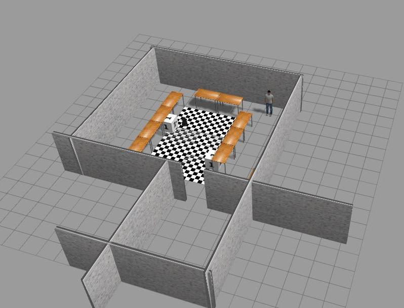
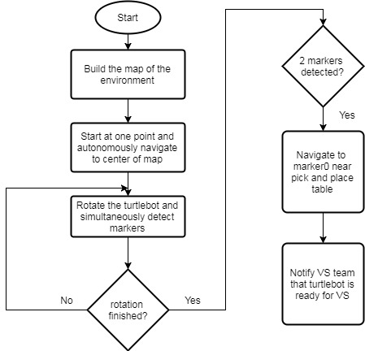

# Mapping, Localization Of ARMarkers and Navigation of Turtlebot using ROS

**Contents**

* [Introduction](#introduction)
* [Task](#task)
* [Strategy](#strategy)
* [Execution](#execution)
* [Videos](#videos)
* [Repository](#repository)

## Introduction

This Repository deals with the code for the project on "Mapping , Localizing AR Markers and navigation of Turtlebot using ROS".

This project is tested with **Ubuntu 14.04 LTS** and **ROS Indigo**. 

Nodes are developed in **Python**.

The report for the project is added as a pdf file, which includes the problem statement, strategy employed, packages used and details about the installation.

The simulated world in Gazebo is as under:

## Task
The motto of the project is to gain experience in the implementation of different robotic algorithms using ROS framework.
1.	The first step of task is to build a map of the environment and navigate to a desired location in the map. 
2.	Next, we have to sense the location of marker (e.g. AR marker, color markers etc) in the map, where there is pick and place task, and autonomously localise and navigate to the desired marker location. 
3.	After reaching to the desired marker location, we have to precisely move towards the specified location based on visual servoing. 
4.	At the desired location, we have a robotic arm which picks an object (e.g a small cube) and places on our turtlebot (called as pick and place task). 
5.	After, the pick and place task, again the robot needs to find another marker, which specifies the final target location, and autonomously localise and navigate to the desired marker location, which finishes the complete task of the project. 

**(This code deals with points 1, 2 and 5)**

## Strategy

The strategy implmented for the task is shown as a flow chart below:

AR marker used :

## Execution

### Real Time

1. Connect to turtlebot from the workstation

`ssh turtlebot@ipaddress`

2. Bringup the robot, run the following *on the turtlebot*

`roslaunch turtlebot_bringup minimal.launch`

3. Mapping the environment using turtlebot, run the below code *on the turtlebot*

`roslaunch turtlebot_navigation gmapping_demo.launch`

4. Launch rviz to view the map, run the below code *on the workstation*

`roslaunch turtlebot_rviz_launchers view_navigation.launch`

5. Teleoperation to move the robot, run the below code *on the workstation*

`roslaunch turtlebot_teleop logitech_teleop.launch`

6. Navigate around the world and build the map

7. After complete mapping, save the map using below code , run *on the turtlkebot*

`rosrun map_server map_saver -f /tmp/my_map`

8. Change the amcl_demo launch file in turtlebot_navigation package on turtlebot, make the boolean values of registration, processing set to True.

9. Start amcl_demo , run the follwoing code *on the turtlebot*

`roslaunch turtlebot_bringup minimal.launch` (If minimal is not launched earlier)

`roslaunch turtlebot_navigation amcl_demo.launch map_file:=/path_to_your_map_file`

10. Run the nodes by launching a alltask launch file, run the below code *on the workstation*

`roslaunch Robo_Project alltask.launch`

### Simulation

1. Open an empty world in Gazebo

`roslaunch turtlebot_gazebo turtlebot_world.launch`

2. Build you own world and save the world as sdf file.

3. Opening your own world

`roslaunch turtlebot_gazebo turtlebot_world.launch world_file:=/path_to_your_world`

4. Mapping the world
`roslaunch turtlebot_gazebo gmapping_demo.launch`

5. Navigating by Teleop
`roslaunch turtlebot_teleop keyboard_teleop.launch`

6. Save the map

`rosrun map_server map_saver -f /tmp/my_map`

7. Start amcl_demo

`roslaunch turtlebot_gazebo amcl_demo.launch map_file:=/path_to_your_map_file`

8. Run the nodes for the task

`roslaunch Robo_Project_Simulation alltask.launch`

## Videos

The video of simulation can be seen here : https://www.youtube.com/watch?v=v1oM5tGOu0M&feature=youtu.be

The video of real time turtlebot can be seen here : https://www.youtube.com/watch?v=AO0xJKQYJgk&feature=youtu.be

The video of real time turtlebot with intergrating visual servoing task (https://github.com/PamirGhimire/visualServoing_ROSProject) can be sen here : https://www.youtube.com/watch?v=hZTU4JiTiyA&feature=youtu.be

## Repository

### Robo_Project

This folder contains the launch files, script files to run the code and map file.

### Robo_Project_Simulation

This folder contains the launch files, script files to run the code and world file and map file for **Gazebo** simulation.
